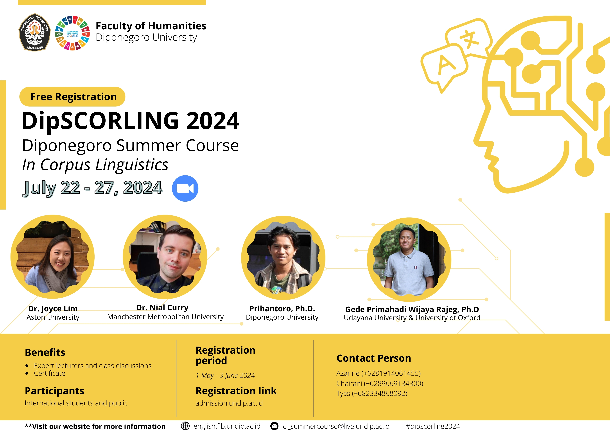

<!-- README.md is generated from README.Rmd. Please edit that file -->

```{r, include = FALSE}
knitr::opts_chunk$set(
  collapse = TRUE,
  comment = "#>"
)
```


<!-- badges: start -->

[](https://zenodo.org/doi/10.5281/zenodo.12793922)

<!-- badges: end -->

## How to cite

In Unified style sheet for linguistics, you can cite this repository if you use it in your teaching/research as follows:

> Rajeg, Gede Primahadi Wijaya. 2024. Materials for the Diponegoro Summer Course in Corpus Linguistics (DipSCORLING 2024) (22 - 27 July 2024). R Quarto. Zenodo. https://doi.org/10.5281/zenodo.12793922. (22 July, 2024).

Check the released versioning of this repository [here](https://github.com/complexico/dipscorling2024/releases).

## Overview

This repository will provide my materials for *Diponegoro Summer Course in Corpus Linguistics 2024* (DipSCORLING 2024) (22 - 27 July 2024 via Zoom). DipSCORLING 2024 facilitates a pedagogical goal of [*CompLexico*](https://github.com/complexico) (a research group within [CIRHSS](https://www.cirhss.org/)) in introducing computer-assisted method for the study of language to linguistic students and researchers in Indonesia and beyond.

## Registration information

Below are some important information regarding registration (source: [Prihantoro's Facebook group-post](https://www.facebook.com/groups/471206953085498/permalink/2325617937644381/)):

- Registration page (open from 1 May - 3 June 2024): [https://admission.undip.ac.id](https://admission.undip.ac.id)

- YouTube tutorial to create an account at https://admission.undip.ac.id for the registration: [https://www.youtube.com/watch?v=1v1YS1FmDxw](https://www.youtube.com/watch?v=1v1YS1FmDxw)

- Planned schedule [here](https://docs.google.com/document/d/1KQHpSOUkBb7DDr_VB1XMvGZ8zUulzJvwF0to2l-ZhFA/mobilebasic?)

## Flyer

```{r flyer, echo = FALSE}

```
