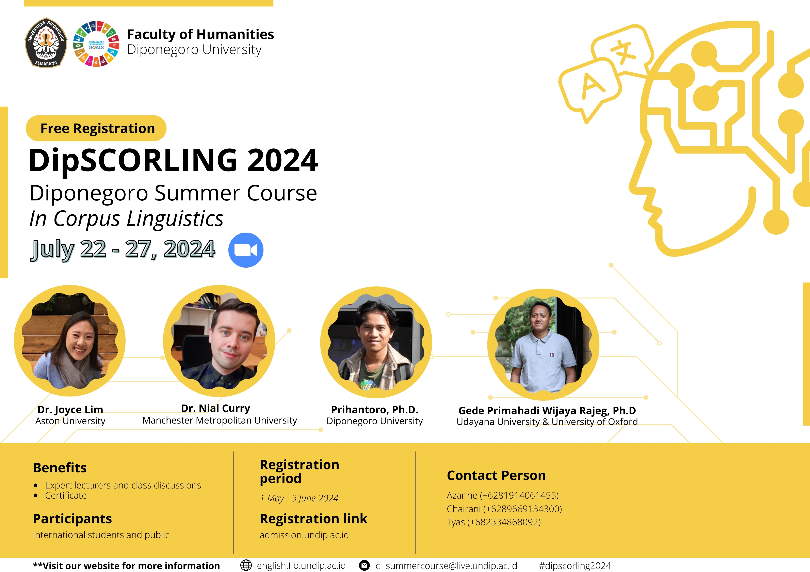

Materials for the *Diponegoro Summer Course in Corpus Linguistics*
(*DipSCORLING 2024*)
================
[Gede Primahadi Wijaya
Rajeg](https://www.ling-phil.ox.ac.uk/people/gede-rajeg)

- [How to cite](#how-to-cite)
- [Overview](#overview)
- [Registration information](#registration-information)
- [Flyer](#flyer)

<!-- README.md is generated from README.Rmd. Please edit that file -->
<!-- badges: start -->

The materials in this repository are licensed under
<a href="https://creativecommons.org/licenses/by-nc-sa/4.0/?ref=chooser-v1" target="_blank" rel="license noopener noreferrer" style="display:inline-block;">Creative
Commons Attribution-NonCommercial-ShareAlike 4.0
International</a>

<!-- badges: end -->

## How to cite

In Unified style sheet for linguistics, you can cite this repository if
you use it in your teaching/research as follows:

> Rajeg, Gede Primahadi Wijaya. 2024. Materials for the *Diponegoro
> Summer Course in Corpus Linguistics* (*DipSCORLING 2024*) (22 - 27
> July 2024). R Quarto. Zenodo.
> <https://doi.org/10.5281/zenodo.12793922>. (22 July, 2024).

Check the released versioning of this repository
[here](https://github.com/complexico/dipscorling2024/releases).

## Overview

This repository provides the materials I delivered for the *Diponegoro
Summer Course in Corpus Linguistics 2024* (DipSCORLING 2024) (22 - 27
July 2024 via Zoom). DipSCORLING 2024 facilitates a pedagogical goal of
[*CompLexico*](https://github.com/complexico) (a research group within
[CIRHSS](https://www.cirhss.org/)) in introducing computer-assisted
method for the study of language to linguistic students and researchers
in Indonesia and beyond.

I handled the following topics in DipSCORLING 2024:

1.  Frequency List (24 July 2024; 4PM Central Indonesian Time)

    - [Revealjs](https://quarto.org/docs/presentations/revealjs/)
      [Slides in
      HTML](https://github.com/complexico/dipscorling2024/blob/main/01-freqlist.html)[^1]
      (the [PDF
      handout](https://github.com/complexico/dipscorling2024/blob/main/01-freqlist.pdf)
      version); the [source quarto
      file](https://github.com/complexico/dipscorling2024/blob/main/01-freqlist.qmd)
    - [PDF practice
      sheet](https://github.com/complexico/dipscorling2024/blob/main/01-practice.pdf)
      and the [source quarto
      file](https://github.com/complexico/dipscorling2024/blob/main/01-practice.qmd)

2.  Concordance (24 July 2024; 5PM Central Indonesian Time)

    - [Revealjs](https://quarto.org/docs/presentations/revealjs/)
      [Slides in
      HTML](https://github.com/complexico/dipscorling2024/blob/main/02-concordance.html)
      (the [PDF
      handout](https://github.com/complexico/dipscorling2024/blob/main/02-concordance.pdf)
      version); the [source quarto
      file](https://github.com/complexico/dipscorling2024/blob/main/02-concordance.qmd)
    - [PDF practice
      sheet](https://github.com/complexico/dipscorling2024/blob/main/02-practice.pdf)
      and the [source quarto
      file](https://github.com/complexico/dipscorling2024/blob/main/02-practice.qmd)

3.  Collocation (25 July 2024; 4PM Central Indonesian Time)

    - [Revealjs](https://quarto.org/docs/presentations/revealjs/)
      [Slides in
      HTML](https://github.com/complexico/dipscorling2024/blob/main/03-collocation.html)
      (the [PDF
      handout](https://github.com/complexico/dipscorling2024/blob/main/03-collocation.pdf)
      version); the [source quarto
      file](https://github.com/complexico/dipscorling2024/blob/main/03-collocation.qmd)
    - [PDF practice
      sheet](https://github.com/complexico/dipscorling2024/blob/main/03-practice.pdf)
      and the [source quarto
      file](https://github.com/complexico/dipscorling2024/blob/main/03-practice.qmd)

## Registration information

Below are some important information regarding registration (source:
[Prihantoro’s Facebook
group-post](https://www.facebook.com/groups/471206953085498/permalink/2325617937644381/)):

- Registration page (open from 1 May - 3 June 2024):
  <https://admission.undip.ac.id>

- YouTube tutorial to create an account at
  <https://admission.undip.ac.id> for the registration:
  <https://www.youtube.com/watch?v=1v1YS1FmDxw>

- Planned schedule
  [here](https://docs.google.com/document/d/1KQHpSOUkBb7DDr_VB1XMvGZ8zUulzJvwF0to2l-ZhFA/mobilebasic?)

## Flyer

[^1]: To open the slides and move them through like a Power Point,
    download the content of this repository using [the latest version
    archived in Zenodo](https://doi.org/10.5281/zenodo.12793922). Then
    open the .html file in an internet browser of your choice.
